# Руководство администратора — Smart Kids Library (Сатпаев)

Инструкция для **библиотекарей и администраторов** портала. Как управлять
каталогом, новостями, событиями, страницами, AI-помощником и соцсетями.

> **Роли:** `admin` (полный доступ) и `librarian` (контент). Часть разделов
> (модерация, аналитика, настройки) доступна только роли `admin`.

---

## Содержание

1. [Вход в админ-панель](#1-вход-в-админ-панель)
2. [Панель управления (Dashboard)](#2-панель-управления)
3. [Управление каталогом](#3-управление-каталогом)
4. [Новости](#4-новости)
5. [События](#5-события)
6. [Страницы (CMS)](#6-страницы-cms)
7. [Меню сайта](#7-меню-сайта)
8. [База знаний ИИ](#8-база-знаний-ии)
9. [Аналитика](#9-аналитика)
10. [Модерация](#10-модерация)
11. [Соцсети и автопостинг](#11-соцсети-и-автопостинг)
12. [Безопасность и частые вопросы](#12-безопасность-и-частые-вопросы)

---

## 1. Вход в админ-панель

Админ-панель находится по адресу **`/admin`** (например
`сайт.kz/ru/admin`). Если вы не авторизованы, сайт перенаправит на форму
входа.

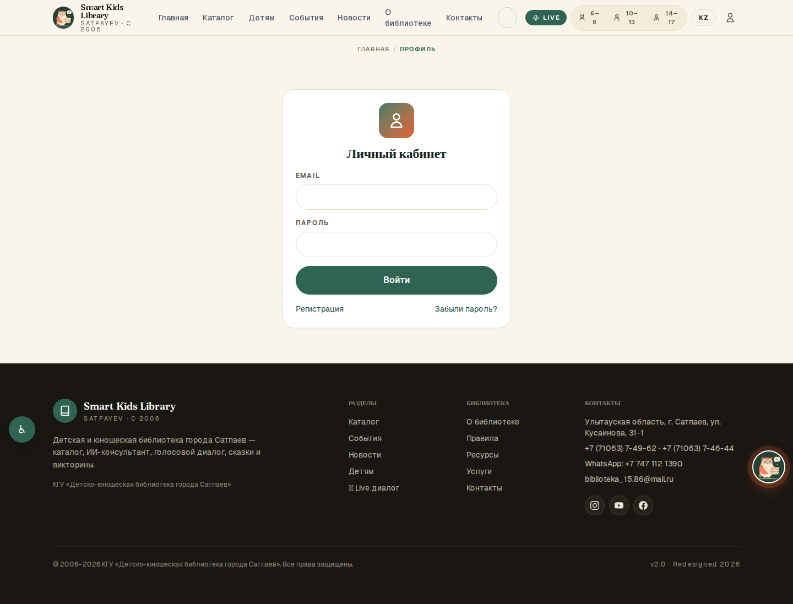

Введите email и пароль вашей учётной записи администратора.

> **Учётная запись администратора** создаётся при первичной настройке
> сайта (через переменные `SEED_ADMIN_EMAIL` / `SEED_ADMIN_PASSWORD` —
> см. [DEPLOYMENT.md](DEPLOYMENT.md)). В базовой поставке админа нет —
> это сделано из соображений безопасности. За созданием/сбросом доступа
> обращайтесь к разработчику.

---

## 2. Панель управления

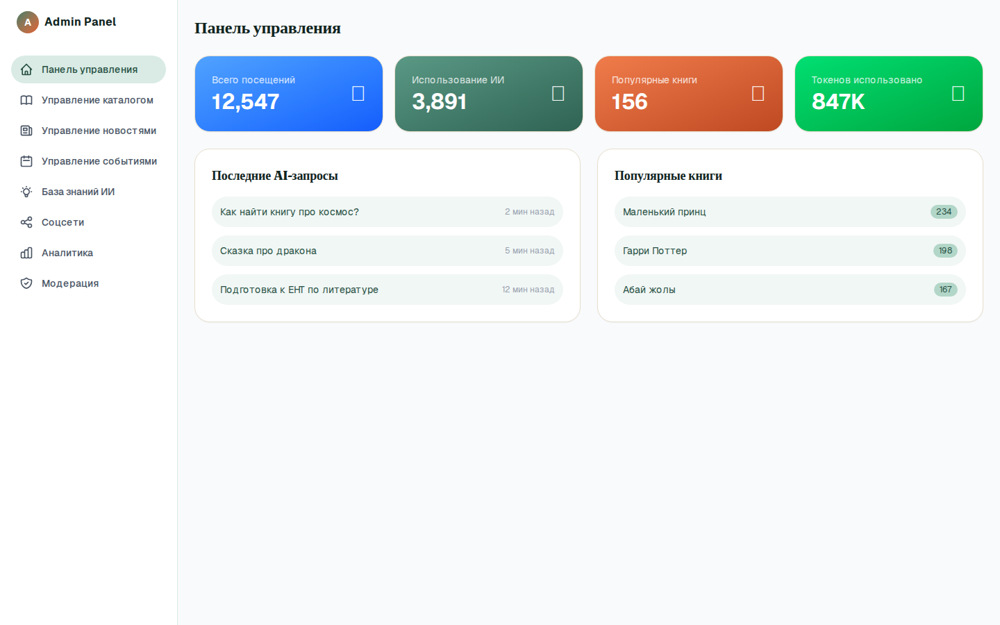

Главный экран после входа. Слева — меню всех разделов. По центру —
сводка: посещения, использование ИИ, популярные книги, израсходованные
токены, последние AI-запросы.

> ⚠️ **Примечание:** часть цифр на этом экране в текущей версии —
> демонстрационные (плейсхолдеры). Реальная статистика — в разделе
> **«Аналитика»**.

---

## 3. Управление каталогом

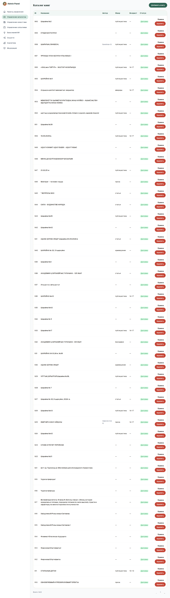

Здесь — все книги фонда (943 материала). Возможности:
- **Добавить книгу** — название (RU/KK), автор, описание, жанр, возраст,
  файл книги, обложка.
- **Редактировать / удалить** существующую запись.
- **Загрузка файлов** — PDF, DOCX, изображения (whitelist по типу, лимит
  размера; загрузка доступна только сотрудникам).
- **PDF-импорт** — массовое добавление из загруженных PDF с
  автоизвлечением заголовков.

> **Обложки.** У всех 943 книг обложки уже сгенерированы. Если добавляете
> новую книгу без обложки — система создаёт типографическую обложку
> автоматически. Подробнее о пайплайне обложек — в [README](../README.md).

> **Двуязычность.** Заполняйте поля и на русском, и на казахском. Если
> казахская версия пустая — сайт покажет русскую (и наоборот).

---

## 4. Новости

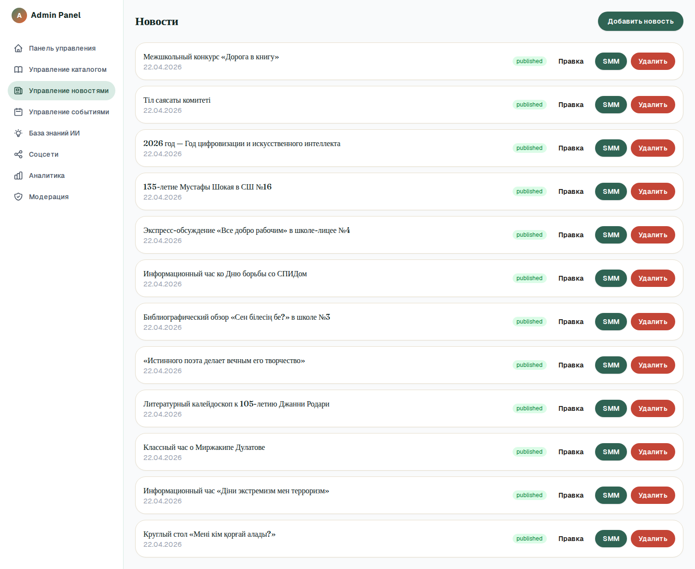

Создание и редактирование новостей библиотеки (с изображениями и видео).
Поля RU/KK, дата публикации, обложка. Опубликованные новости видны в
публичном разделе «Новости».

---

## 5. События

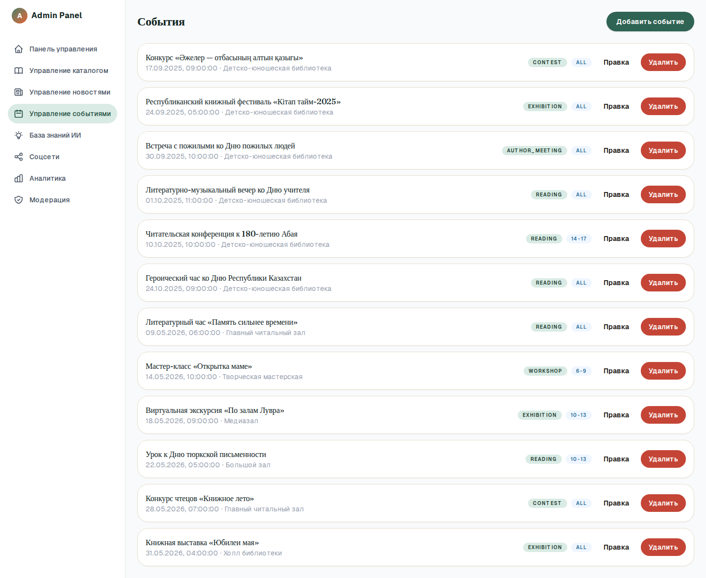

Афиша мероприятий. Для каждого события:
- тип (мастер-класс / встреча с автором / конкурс / выставка / чтение),
- дата и время начала и окончания,
- место, возрастная группа, лимит участников,
- название и описание (RU/KK).

Публичный календарь (раздел «События») читает данные отсюда. Прошедшие
события автоматически помечаются «Прошло», запись на них закрывается.

> При создании активного события система может автоматически поставить
> пост в очередь автопостинга в соцсети (см. раздел 11).

---

## 6. Страницы (CMS)

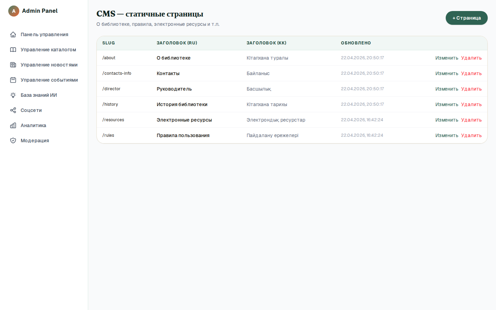

Редактор статических страниц сайта (О библиотеке, Правила, Услуги,
Ресурсы и т.п.). Текст редактируется на двух языках без участия
программиста.

---

## 7. Меню сайта

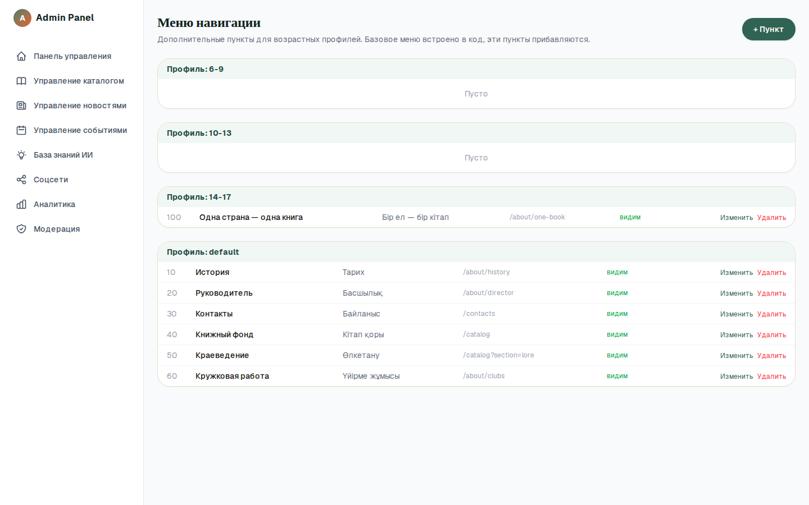

Настройка пунктов навигационного меню: порядок, названия (RU/KK),
ссылки, видимость. Позволяет менять структуру сайта самостоятельно.

---

## 8. База знаний ИИ

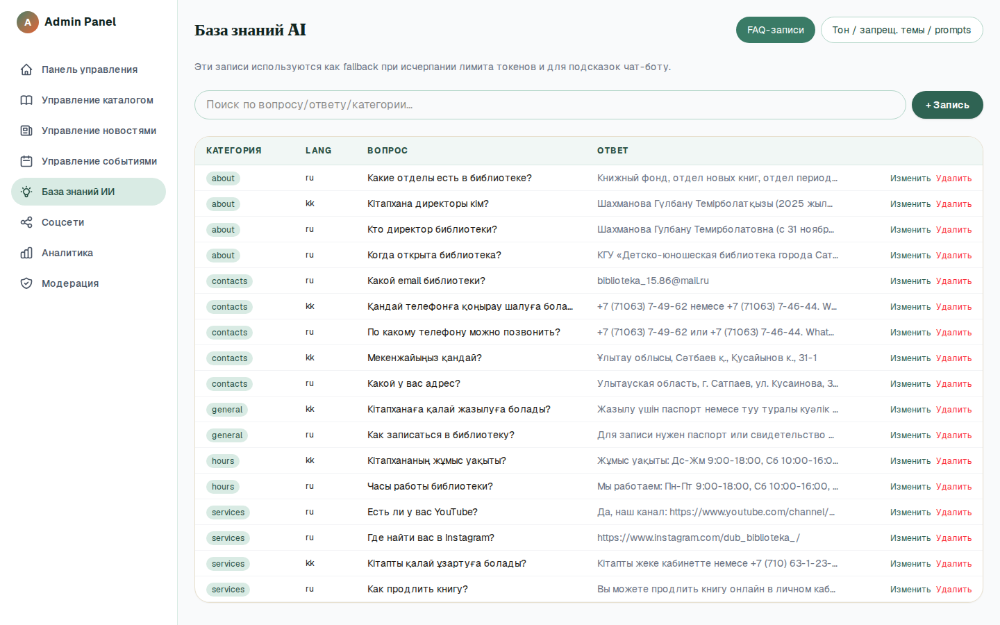

Управление поведением AI-помощника «Кітапхан»:
- **FAQ** — готовые ответы (используются, когда исчерпан лимит ИИ).
- **Тон / запрещённые темы** — настройка стиля и тем, которые AI не
  обсуждает с детьми.

> Это влияет на то, как помощник отвечает посетителям. Меняйте
> аккуратно: формулировки запрещённых тем — часть детской безопасности.

---

## 9. Аналитика

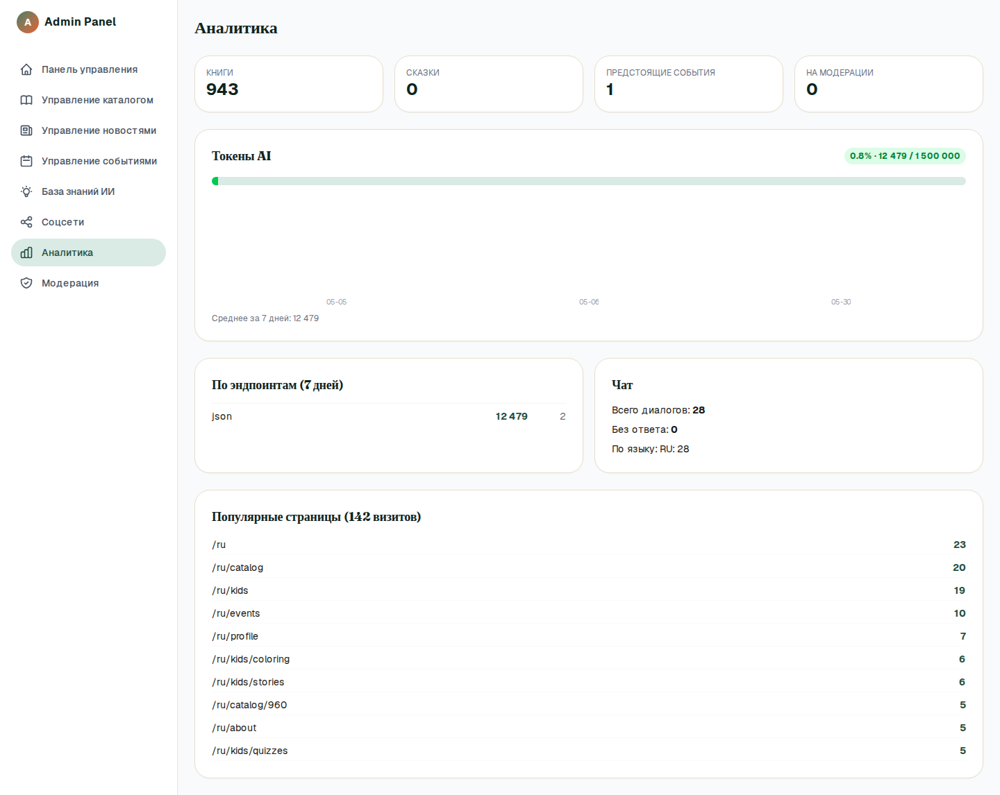

Реальная статистика по сайту: посещения, популярные книги и разделы,
**использование ИИ и расход токенов/бюджета**.

> **AI-бюджет.** У системы есть дневной лимит расходов на ИИ (по
> умолчанию $0.50/сутки) — защита от перерасхода. При достижении лимита
> посетители получают вежливое сообщение, а сайт продолжает работать
> (каталог, чтение и т.д. не зависят от ИИ).

---

## 10. Модерация

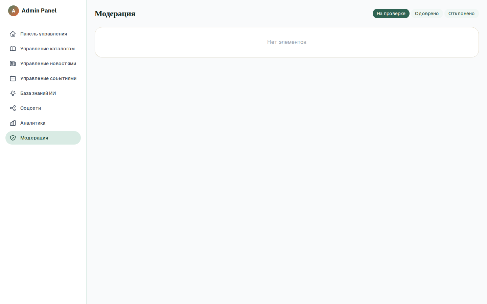

Очередь проверки AI-сгенерированного контента для детей (сказки и т.п.).
Здесь сотрудник может одобрить или отклонить материал перед публикацией.
Доступно роли `admin`.

---

## 11. Соцсети и автопостинг

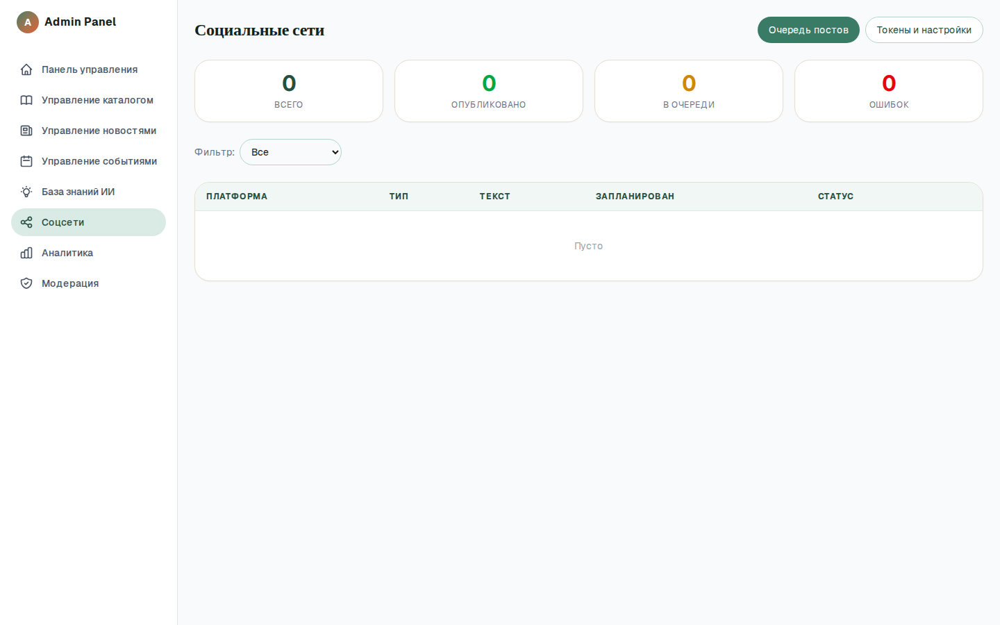

Управление публикациями в Instagram и Telegram:
- ручная публикация поста,
- **очередь автопостинга** (например, анонс события за N часов до начала),
- выбор «оптимального времени» публикации.

> Для работы автопостинга должны быть настроены ключи Telegram Bot API и
> Instagram Graph API (см. [DEPLOYMENT.md](DEPLOYMENT.md)). Без ключей
> раздел работает в режиме черновиков.

---

## 12. Безопасность и частые вопросы

**Кто что может?**
- `admin` — все разделы, включая модерацию, аналитику, настройки.
- `librarian` — контент: каталог, новости, события, страницы, меню.

**Все действия фиксируются?**
Да, ведётся журнал AI-вызовов (расход бюджета) и журнал
административных действий (audit log).

**Забыл пароль администратора.**
Сброс делается на стороне сервера (через переменные окружения или БД).
Обратитесь к разработчику — самостоятельное восстановление для админа не
предусмотрено по соображениям безопасности.

**Можно ли добавить ещё одного сотрудника?**
Да — нужно завести пользователя с ролью `librarian` или `admin`.
Процедура — на стороне сервера; обратитесь к разработчику.

**AI-помощник стал отвечать «лимит исчерпан».**
Достигнут дневной бюджет ИИ. Это норма-защита. Лимит можно увеличить в
настройках сервера (переменные окружения). Каталог и чтение продолжают
работать.

**Не отображаются иконки/некоторые цифры на дашборде.**
Сводка на главном экране админки частично демонстрационная. Достоверные
данные — в разделе «Аналитика». Это будет доработано.

---

### Техническая поддержка

По вопросам настройки, доступов и доработок — к разработчику проекта.
Техническая документация: [README](../README.md) ·
[DEPLOYMENT.md](DEPLOYMENT.md) · [ARCHITECTURE.md](ARCHITECTURE.md).
