# Руководство пользователя — Smart Kids Library (Сатпаев)

Инструкция для читателей, детей и родителей. Как пользоваться порталом
Детско-юношеской библиотеки города Сәтбаев.

> Сайт работает на двух языках — **русском** и **қазақ тілінде**.
> Переключатель языка — в правом верхнем углу (RU / KK).

---

## Содержание

1. [Главная страница](#1-главная-страница)
2. [Каталог книг](#2-каталог-книг)
3. [Чтение книги онлайн](#3-чтение-книги-онлайн)
4. [AI-помощник «Кітапхан»](#4-ai-помощник-кітапхан)
5. [Детский раздел](#5-детский-раздел)
6. [Голосовой помощник](#6-голосовой-помощник)
7. [События библиотеки](#7-события-библиотеки)
8. [Регистрация и личный кабинет](#8-регистрация-и-личный-кабинет)
9. [Частые вопросы](#9-частые-вопросы)

---

## 1. Главная страница

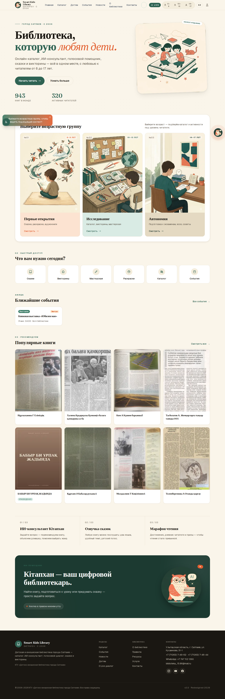

На главной странице:
- **Поиск и навигация** — меню сверху: Каталог, Детям, События и др.
- **Выбор возрастной группы** — 6–9, 10–13, 14–17 лет (подбирает книги под возраст).
- **Новые поступления** — последние добавленные книги.
- **AI-помощник** — кнопка-кружок справа внизу (оранжевая), открывает чат.
- **Переключатель языка** RU / KK — справа вверху.

На телефоне внизу появляется панель быстрого доступа: Главная · Каталог ·
Детям · События · Голос · Профиль.

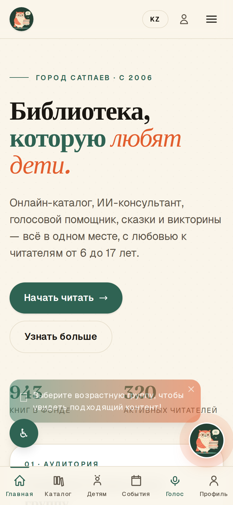

---

## 2. Каталог книг

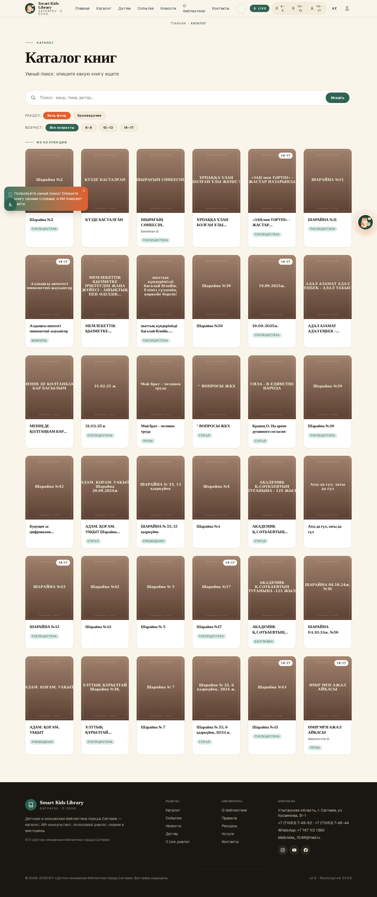

В каталоге **943 материала** (краеведение об Улытау и Сатпаев, детская и
учебная литература). У каждой книги есть обложка.

**Как искать:**
- **Строка поиска** — по названию, автору или теме.
- **Фильтр «Раздел»** — Весь фонд / Краеведение.
- **Фильтр «Возраст»** — 6–9 / 10–13 / 14–17 / все.

Нажмите на карточку книги, чтобы открыть её страницу.

### Страница книги

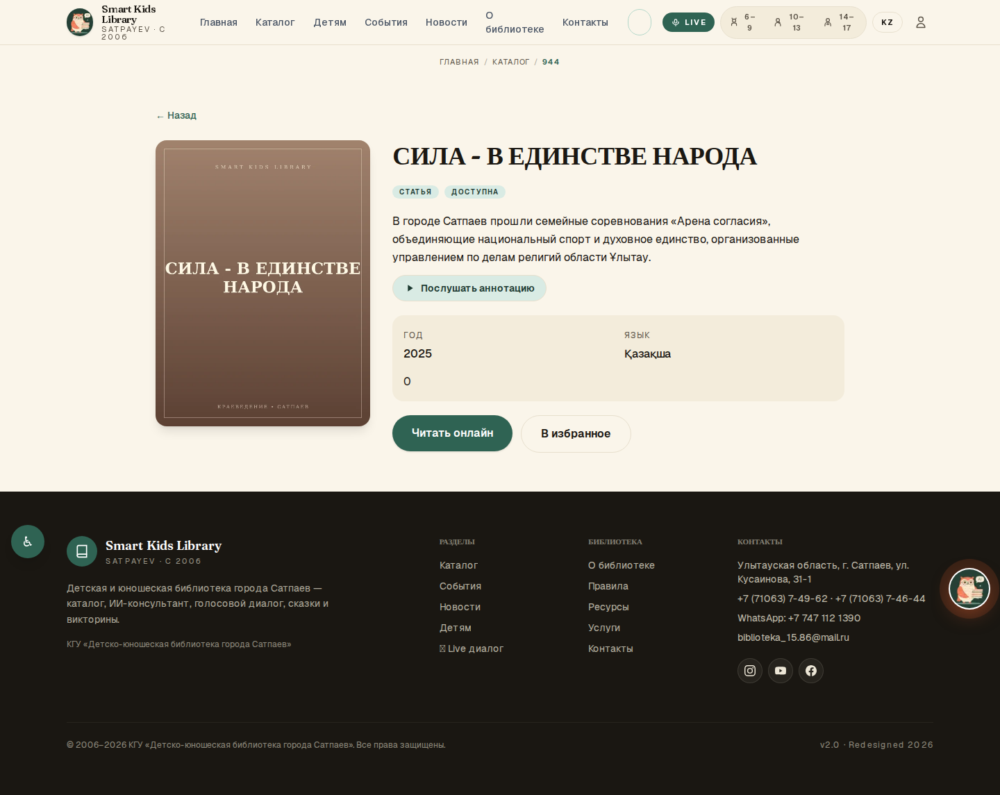

Здесь: обложка, описание, кнопки **«Читать онлайн»**, **«Послушать
аннотацию»** (озвучка), **«В избранное»**.

---

## 3. Чтение книги онлайн

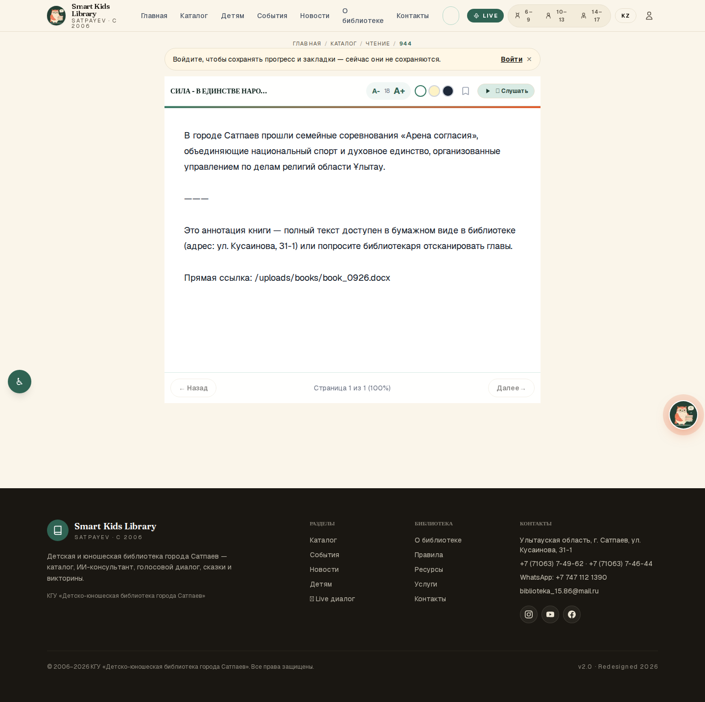

Встроенная читалка позволяет:
- **A− / A+** — уменьшить или увеличить шрифт.
- **Темы** — светлая / сепия / тёмная (удобно для глаз вечером).
- **Закладки** — сохранить место (нужен вход в личный кабинет).
- **🔊 Слушать** — озвучивание текста голосом.

> Чтобы сайт запоминал, на какой странице вы остановились, и сохранял
> закладки — войдите в личный кабинет (см. раздел 8).

---

## 4. AI-помощник «Кітапхан»

Оранжевая кнопка-кружок справа внизу на любой странице открывает чат с
цифровым библиотекарем **«Кітапхан»**. Он:
- подскажет, **какие книги есть в каталоге** по нужной теме;
- поможет **с учёбой по литературе** (школьная программа 1–11 классов);
- ответит на вопросы о библиотеке;
- если не сможет помочь — предложит **связаться с живым библиотекарем**.

**Режимы чата** (кнопки вверху окна): Общий · Поиск книг · Учёба.

**Голосовой ввод** — нажмите значок микрофона 🎤 в чате и говорите
(работает в браузере Chrome; разрешите доступ к микрофону).

> Помощник отвечает **только о книгах, которые реально есть в каталоге**.
> Если книги нет — он честно скажет «не нашёл, посмотрите в каталоге», а
> не выдумает название.

---

## 5. Детский раздел

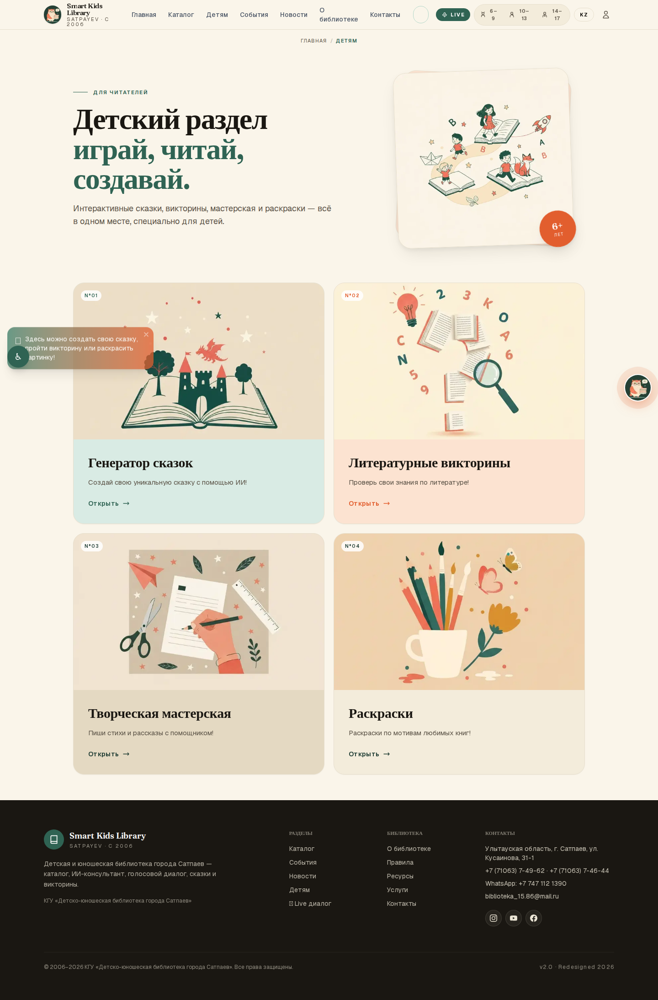

Раздел **«Детям»** — творческие и обучающие инструменты:

| Раздел | Что делает |
|---|---|
| **Генератор сказок** | Придумывает персональную сказку с вашим именем, темой и героем |
| **Викторины** | Вопросы по книгам и общим знаниям |
| **Мастерская** | Творческие задания |
| **Раскраски** | Картинки для раскрашивания + сохранение в PDF |

### Генератор сказок

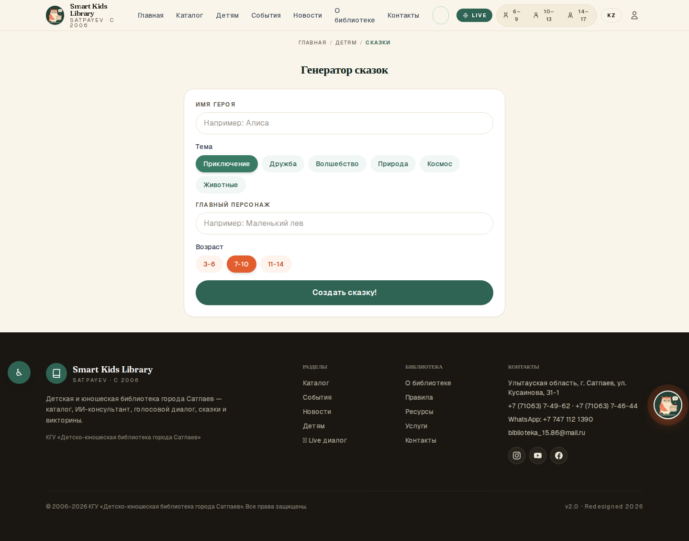

Заполните: имя ребёнка, тему, персонажа, возраст — нажмите **«Создать
сказку»**. Сказку можно **послушать** (озвучка) и **сохранить**.
В конце сказки часто есть выбор «Что будет дальше?» — история продолжается
по вашему решению.

### Раскраски

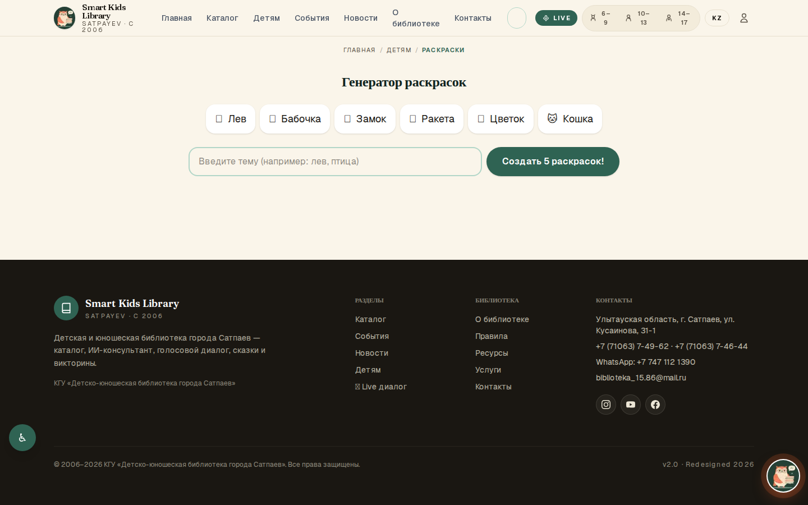

Выберите картинку, раскрасьте и скачайте в PDF, чтобы распечатать.

---

## 6. Голосовой помощник

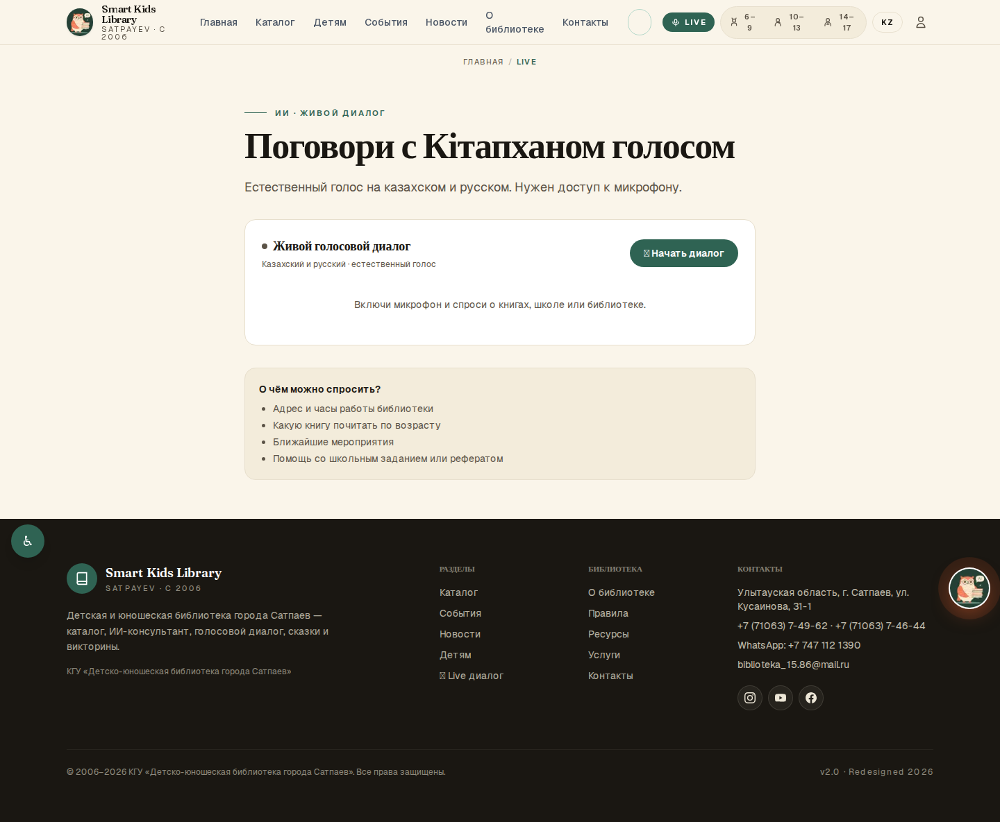

Раздел **«Голос»** (в нижнем меню на телефоне или `/live`) — живой
голосовой диалог с библиотекарем «Кітапхан». Нажмите кнопку микрофона,
разрешите доступ — и можно **говорить вслух**, помощник ответит голосом.

> Нужен браузер с поддержкой микрофона (Chrome) и разрешение на доступ.

---

## 7. События библиотеки

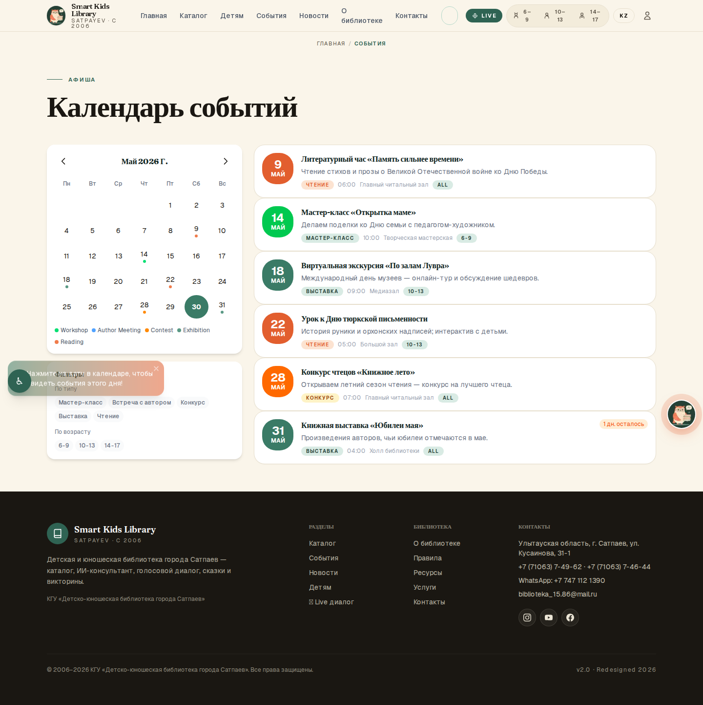

Афиша мероприятий: мастер-классы, встречи с авторами, конкурсы, выставки,
часы чтения.
- **Календарь** — дни с событиями отмечены точками.
- **Фильтры** — по типу события и по возрасту.
- **Карточка события** — дата, время, место, описание.

Для **предстоящих** событий есть кнопка записи. На **прошедших** событиях
вместо кнопки показано «Регистрация на это событие завершена» и метка
«Прошло».

---

## 8. Регистрация и личный кабинет

Вход и регистрация — раздел **«Профиль»**.

### Регистрация

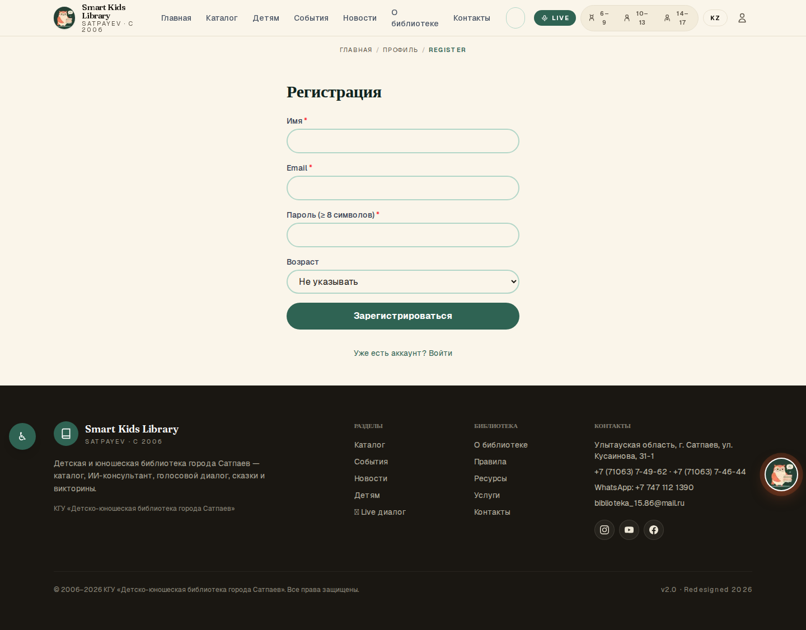

Нажмите «Зарегистрироваться», заполните: имя, email, пароль (не короче
8 символов), возрастную группу.

### Зачем нужен личный кабинет
- сохраняется **прогресс чтения** и **закладки**;
- работает **геймификация** — баллы, достижения, серия дней (streak),
  таблица лидеров;
- **избранные** книги.

### Забыли пароль
На странице входа — «Восстановить пароль». Введите email, следуйте
инструкции.

> Вводить пароль нужно только вам. Сотрудники библиотеки никогда не
> спрашивают ваш пароль.

---

## 9. Частые вопросы

**Сайт на казахском — как переключить?**
Кнопка RU / KK в правом верхнем углу. Переключается весь сайт, включая
AI-помощника.

**Нужно ли регистрироваться, чтобы читать?**
Нет. Каталог и чтение доступны всем. Регистрация нужна только для
сохранения прогресса, закладок и баллов.

**AI-помощник не отвечает / пишет «лимит исчерпан».**
У AI есть дневной лимит запросов (для экономии). Попробуйте позже или
обратитесь к библиотекарю — телефон в разделе «Контакты».

**Озвучка не воспроизводится.**
Иногда сервис озвучки временно недоступен — появится сообщение «Озвучка
недоступна». Попробуйте позже.

**С какого устройства лучше заходить?**
Сайт работает и на компьютере, и на телефоне. На телефоне удобное нижнее
меню. Можно «установить» сайт как приложение (PWA) через меню браузера.

---

### Контакты библиотеки

КГУ «Детско-юношеская библиотека города Сатпаев»
Ұлытау обл., г. Сатпаев, ул. Кусаинова, 31-1
☎ +7 (71063) 7-49-62 · ✉ biblioteka_15.86@mail.ru
Режим работы: 09:00–18:00
